结果分析
=====

## 配置
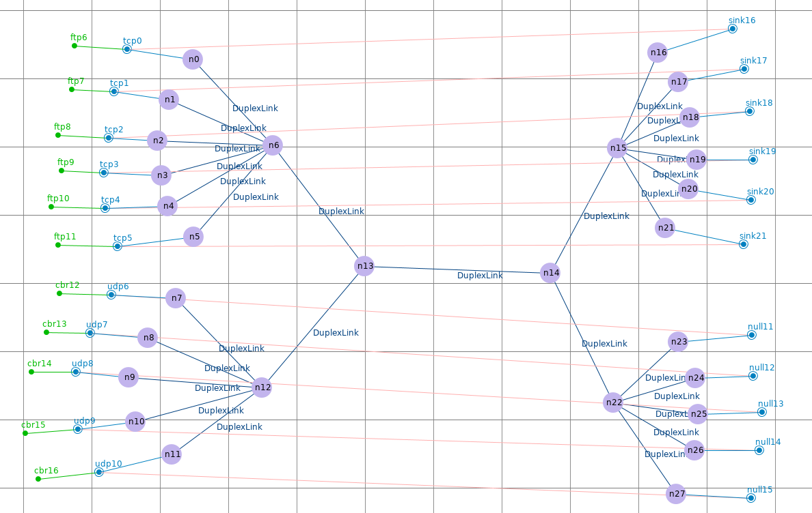

## 重传率 & 端到端延时
|Type | Node         | Rate         | Delay     |
|:----|:-------------|:-------------|:----------|
|tcp  | n0  → n16    | 0.07089552   | 0.101725  |
|     | n1  → n17    | 0.040669855  | 0.102925  |
|     | n2  → n18    | 0.06993007   | 0.104125  |
|     | n3  → n19    | 0.071969695  | 0.105325  |
|     | n4  → n10    | 0.049046323  | 0.105325  |
|     | n5  → n11    | 0.055194806  | 0.107725  |
|     |              |              |           |
|udp  | n7  → n23    | 0.0025201612 | 0.0       |
|     | n8  → n24    | 0.00907258   | 0.0       |
|     | n9  → n25    | 0.025214322  | 0.0       |
|     | n10 → n26    | 0.070095815  | 0.0       |
|     | n11 → n27    | 0.13615733   | 0.0       |

## 网络抖动
|node|jitter                             |node|jitter                             |
|:--:|:---------------------------------:|:--:|:---------------------------------:|
| n0 |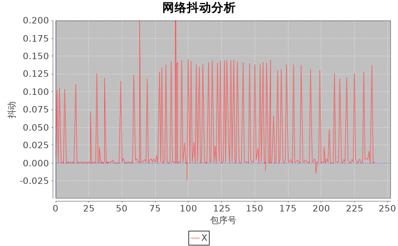{width=600px}| n1 |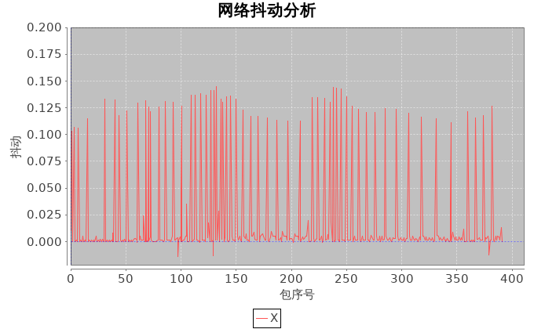{width=600px}|
| n2 |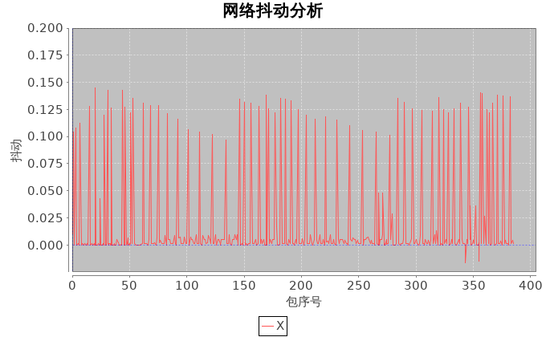{width=600px}| n3 |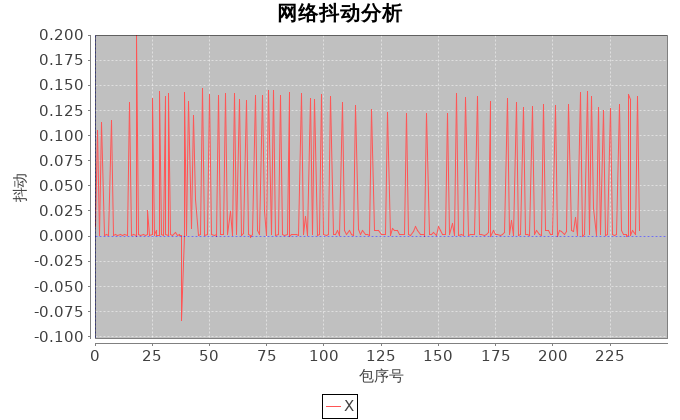{width=600px}|
| n4 |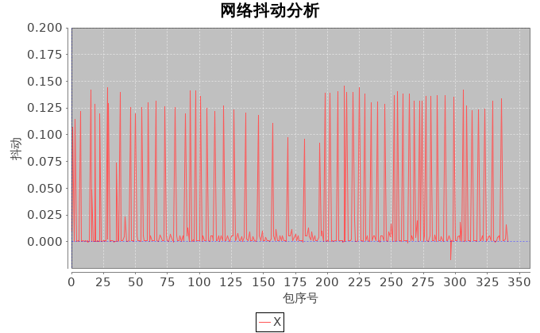{width=600px}| n5 |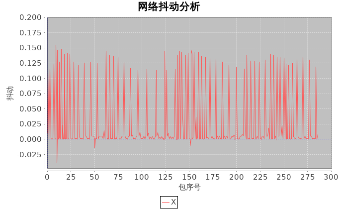{width=600px}|

## 吞吐量
|node|throughput                             |node|throughput                             |
|:--:|:-------------------------------------:|:--:|:-------------------------------------:|
| n0 |{width=600px}| n1 |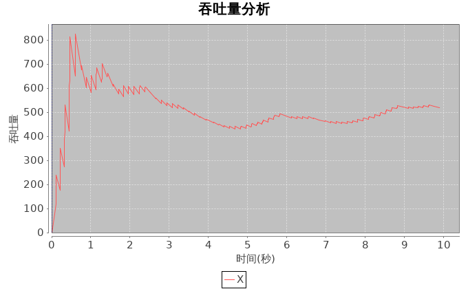{width=600px}|
| n2 |{width=600px}| n3 |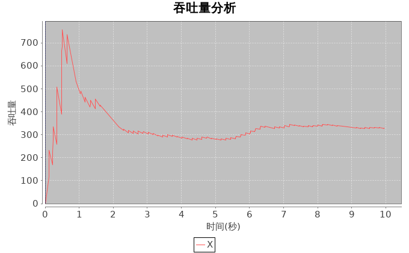{width=600px}|
| n4 |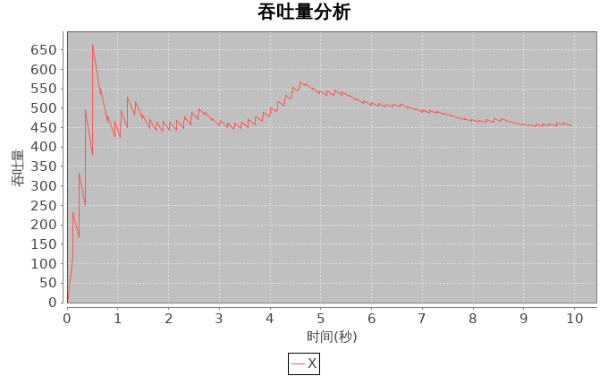{width=600px}| n5 |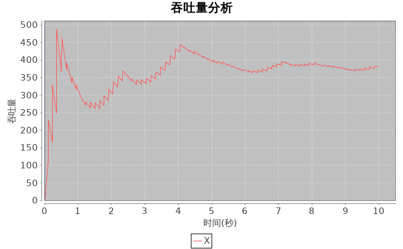{width=600px}|

## 发送/接收
|node|send/receive                         |node|send/receive                         |
|:--:|:-----------------------------------:|:--:|:-----------------------------------:|
| n0 |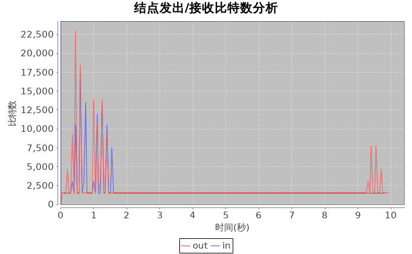{width=600px}| n1 |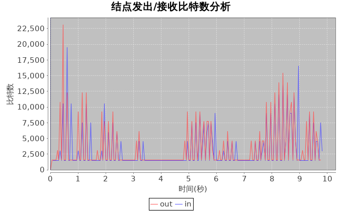{width=600px}|
| n2 |{width=600px}| n3 |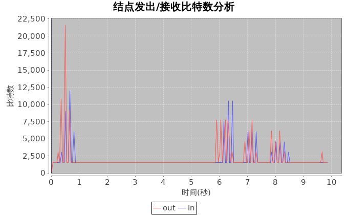{width=600px}|
| n4 |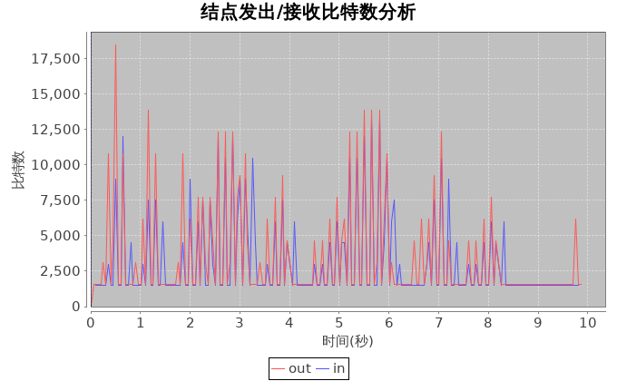{width=600px}| n5 |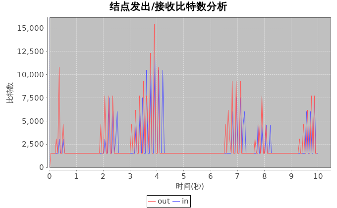{width=600px}|

## 拥塞窗口
|node|window                               |node|window                               |
|:--:|:-----------------------------------:|:--:|:-----------------------------------:|
|tcp0|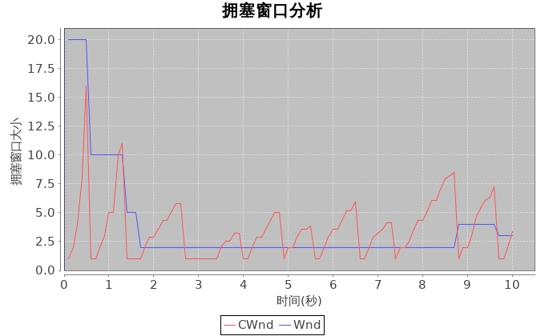{width=600px}|tcp1|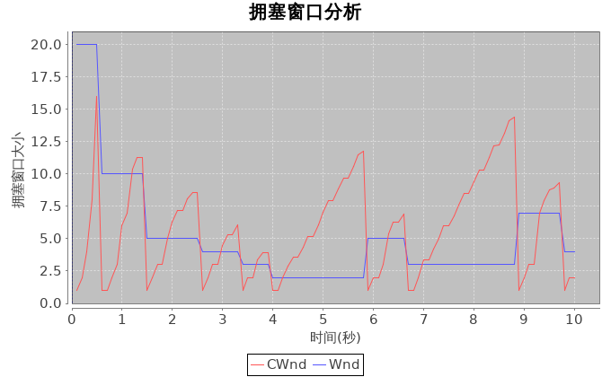{width=600px}|
|tcp2|{width=600px}|tcp2|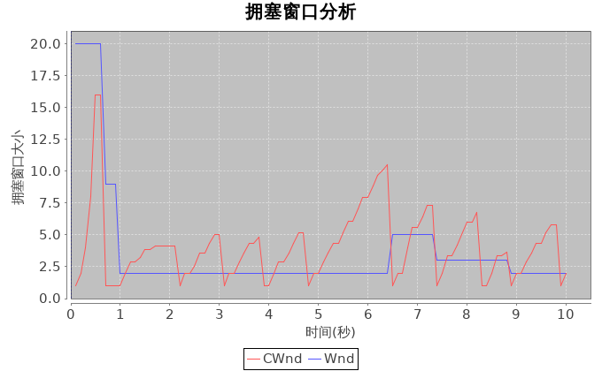{width=600px}|
|tcp4|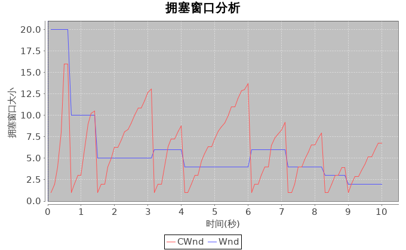{width=600px}|tcp5|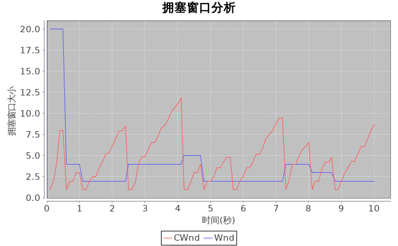{width=600px}|

