结果分析
=====

## 配置
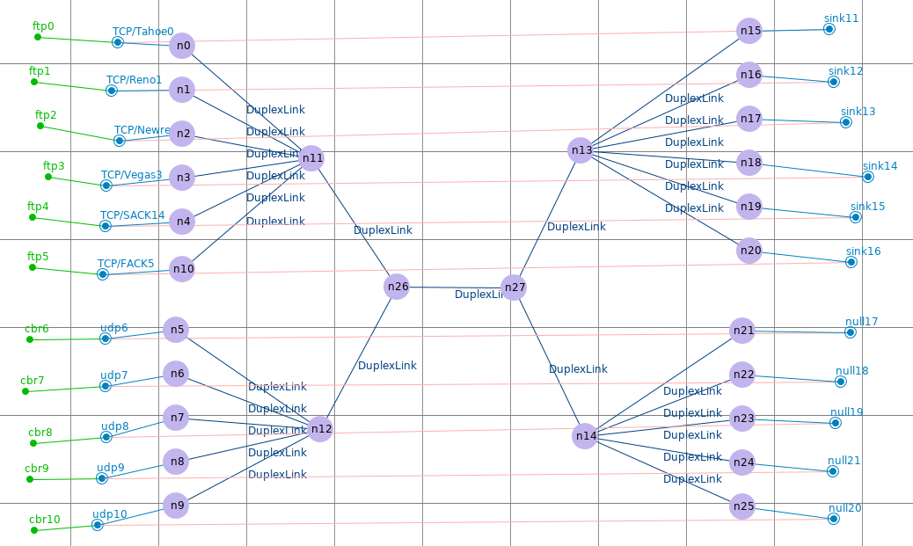

## 重传率 & 端到端延时
|Type        | Node         | Rate         | Delay     |
|:-----------|:-------------|:-------------|:----------|
|tcp/Thole   | n0  → n15    | 0.053672317  | 0.101725  |
|tcp/Reno    | n1  → n16    | 0.040871933  | 0.102925  |
|tcp/newReno | n2  → n17    | 0.05437352   | 0.104125  |
|tcp/Vegas   | n3  → n18    | 0.0125       | 0.107725  |
|tcp/Sack    | n4  → n19    | 0.07266436   | 0.105325  |
|tcp/Fack    | n10 → n20    | 0.115384616  | 0.106525  |
|            |              |              |           |
|udp         | n5  → n21    | 0.0020181634 | 0.0       |
|            | n6  → n22    | 0.0060544903 | 0.0       |
|            | n7  → n23    | 0.018677436  | 0.0       |
|            | n8  → n24    | 0.050984353  | 0.0       |
|            | n9  → n25    | 0.1207851    | 0.0       |

## 网络抖动
|node|jitter                             |node|jitter                              |
|:--:|:---------------------------------:|:--:|:----------------------------------:|
| n0 |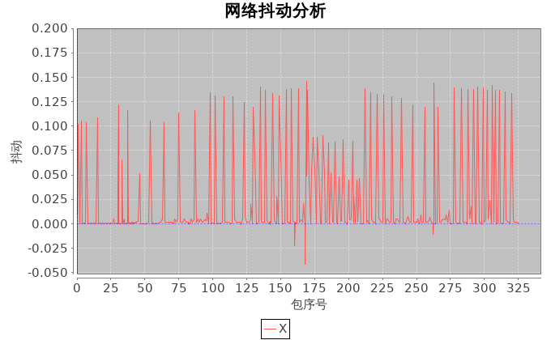{width=600px}| n1 |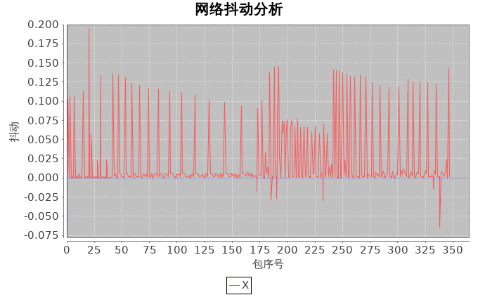{width=600px} |
| n2 |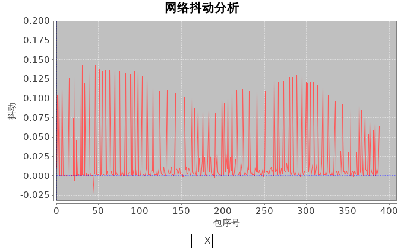{width=600px}| n3 |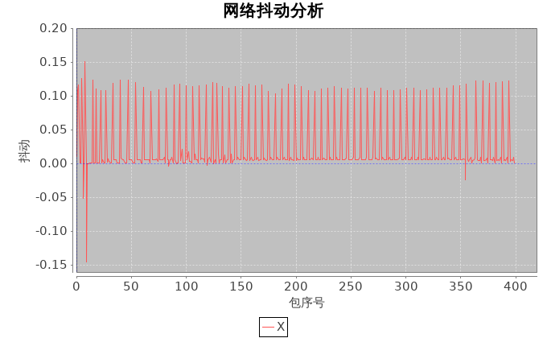{width=600px} |
| n4 |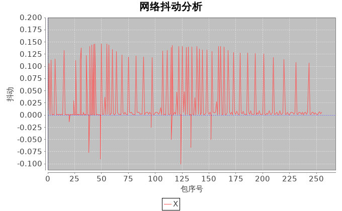{width=600px}| n10|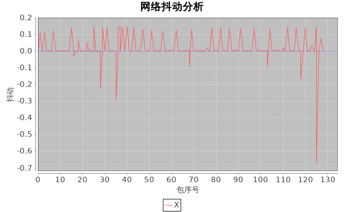{width=600px}|

## 吞吐量
|node|throughput                             |node|throughput                             |
|:--:|:-------------------------------------:|:--:|:-------------------------------------:|
| n0 |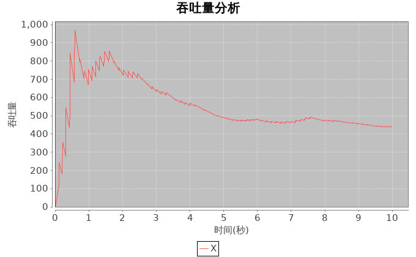{width=600px}| n1 |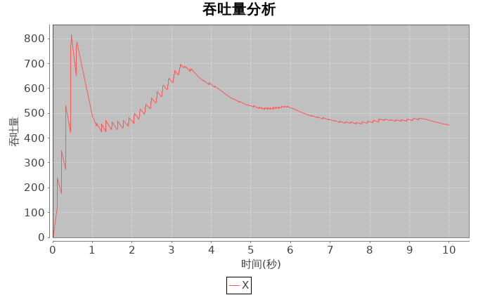{width=600px}|
| n2 |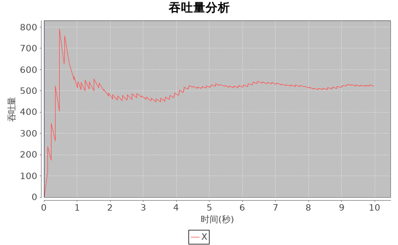{width=600px}| n3 |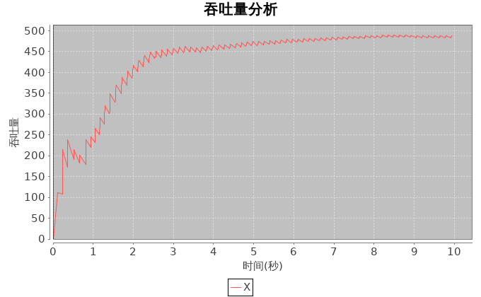{width=600px}|
| n4 |{width=600px}| n5 |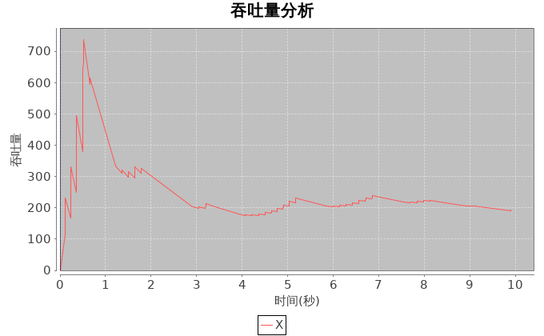{width=600px}|

## 发送/接收
|node|send/receive                         |node|send/receive                         |
|:--:|:-----------------------------------:|:--:|:-----------------------------------:|
| n0 |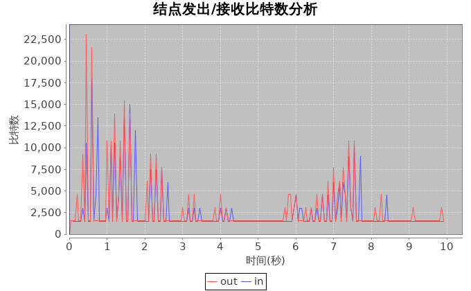{width=600px}| n1 |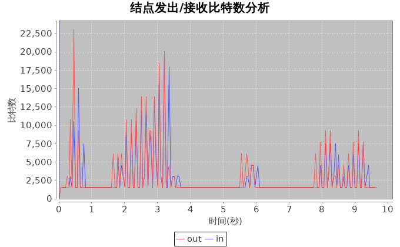{width=600px}|
| n2 |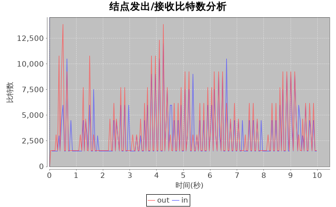{width=600px}| n3 |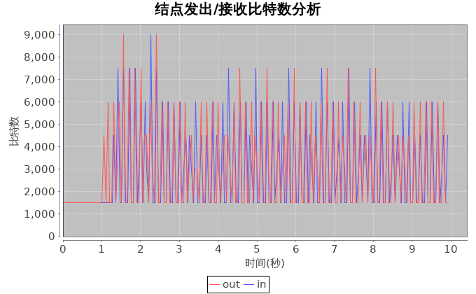{width=600px}|
| n4 |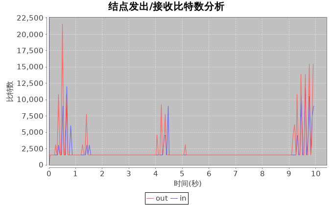{width=600px}| nA |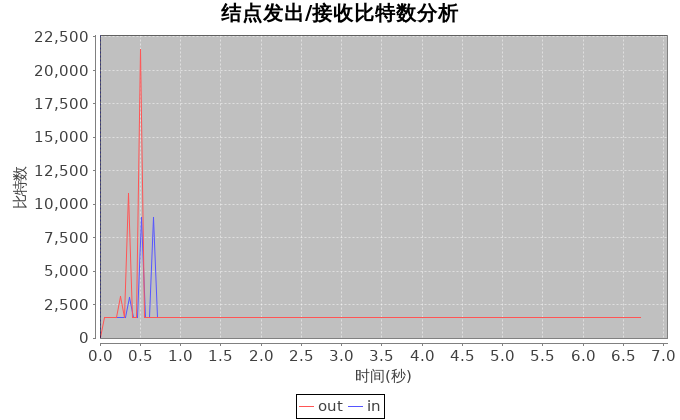{width=600px}|

## 拥塞窗口
|node|window                               |node|window                               |
|:--:|:-----------------------------------:|:--:|:-----------------------------------:|
|tcp0|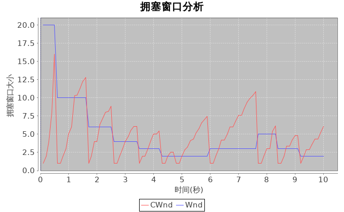{width=600px}|tcp1|{width=600px}|
|tcp2|{width=600px}|tcp3|{width=600px}|
|tcp4|{width=600px}|tcp5|{width=600px}|

