结果分析
=====

## 配置

## 拥塞窗口
| TCP Agent | UDP Pack Size = 250                    | UDP Pack Size = 1000                 | UDP Pack Size = 2000                 |
|:----------|:---------------------------------------|:-------------------------------------|:-------------------------------------|
| tcp0/Tahoe| 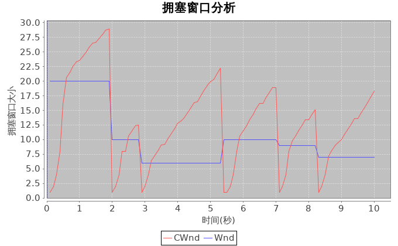{witdth=600px}| {witdth=600px} |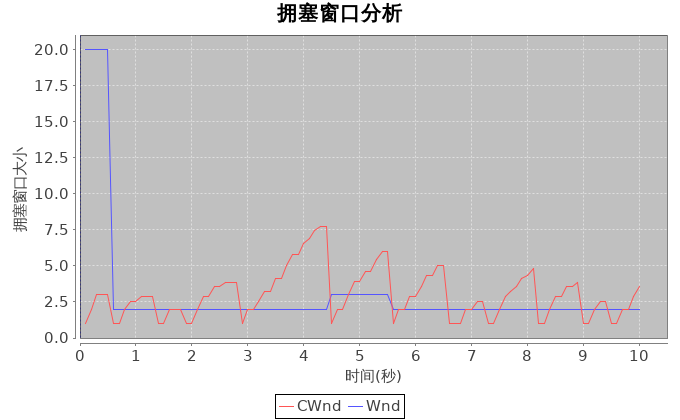{witdth=600px}|
| tcp1/Reno | 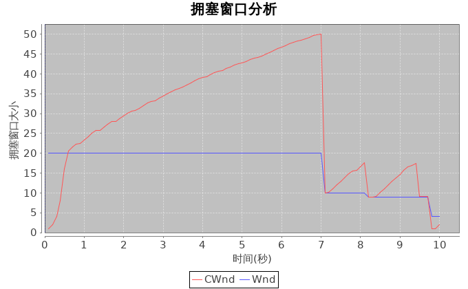{witdth=600px}| 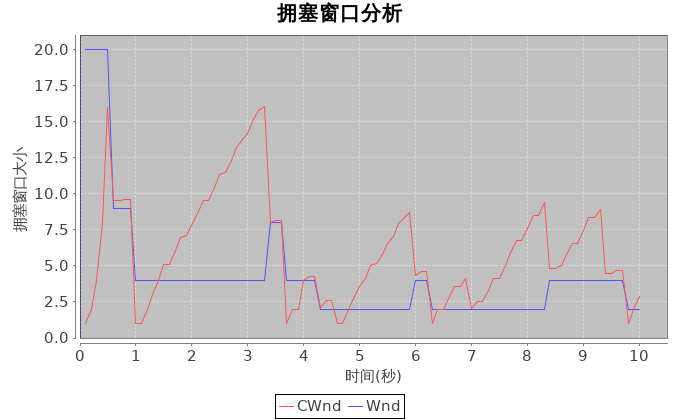{witdth=600px} |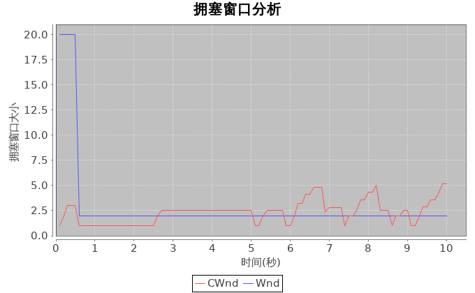{witdth=600px}|
| tcp2/newR | 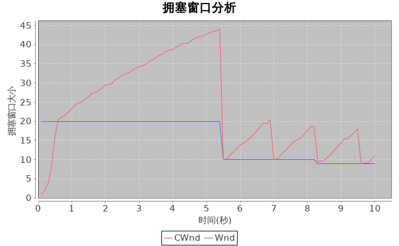{witdth=600px}| 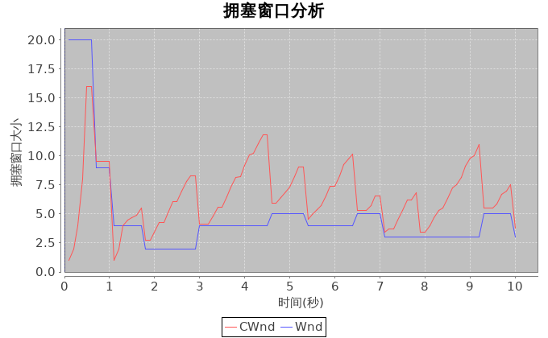{witdth=600px} |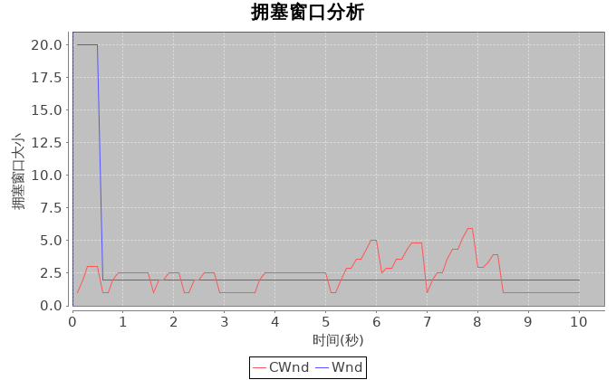{witdth=600px}|
| tcp3/Vegas| 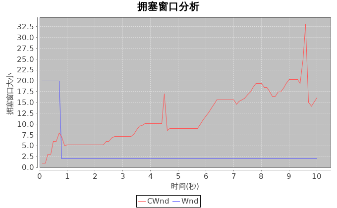{witdth=600px}| 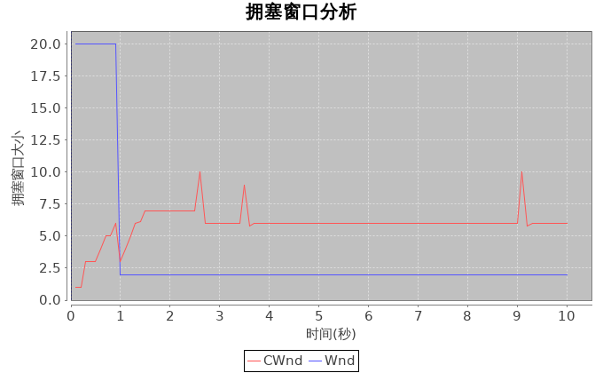{witdth=600px} |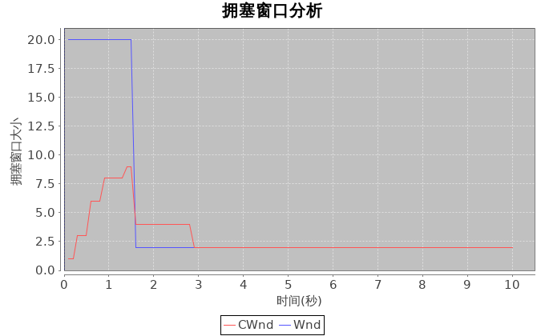{witdth=600px}|
| tcp4/Sack | 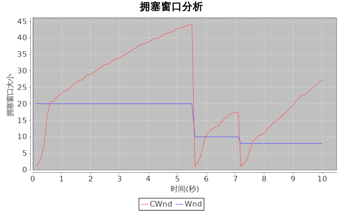{witdth=600px}| 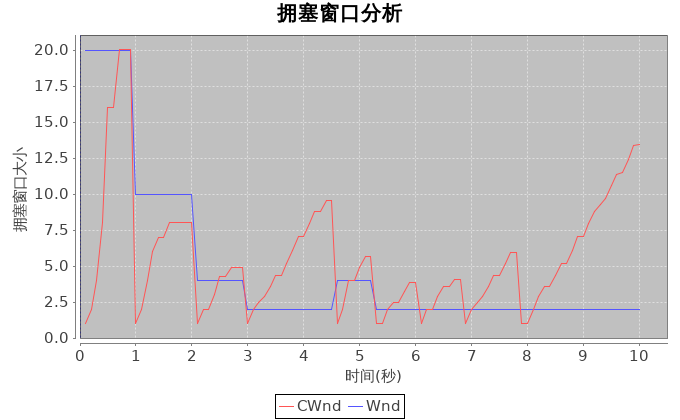{witdth=600px} |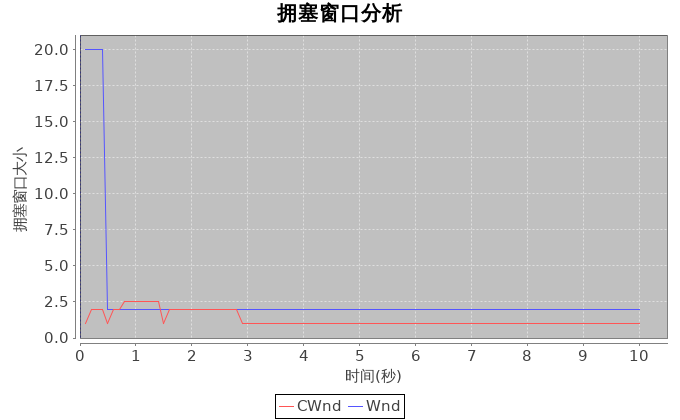{witdth=600px}|
| tcp5/Fack | 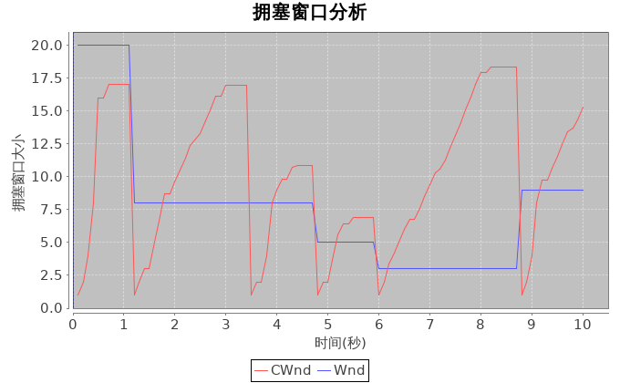{witdth=600px}| 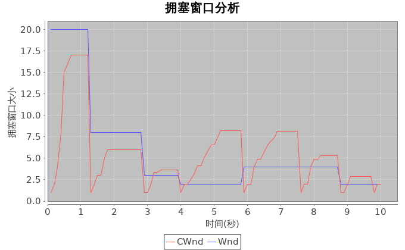{witdth=600px} |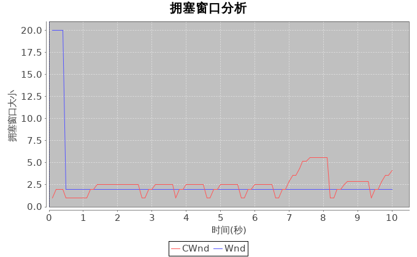{witdth=600px}|

