结果分析
=====

## 配置

## 发送/接收

### UDP pack size = 250

| Proxy    | Total Sent | Total Receive | Usage  | Delay    | Send/Receive                                |
|:---------|:-----------|:--------------|:-------|:---------|:--------------------------------------------|
| DropTail | 21272160   | 21389820      | 42.66% | 0.081485 | 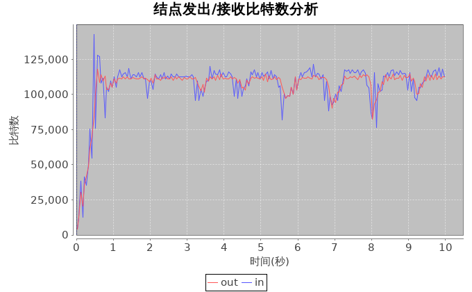{width=600px}|
| DRR      | 20024240   | 20111900      | 40.14% | 0.081485 | 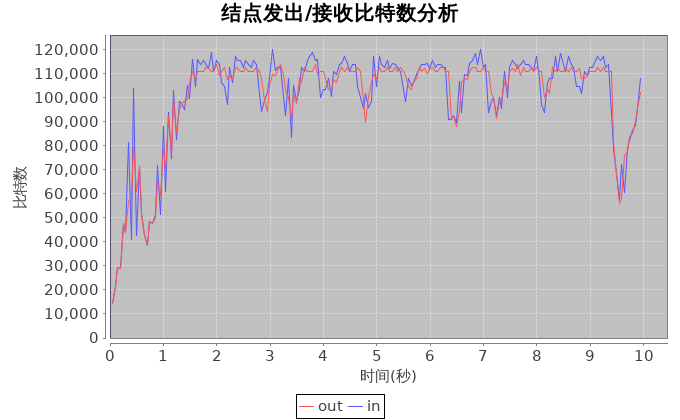{width=600px}     |
| RED      | 18313300   | 18422120      | 36.74% | 0.081485 | {width=600px}     |
| FQ       | 22266460   | 23008560      | 45.28% | 0.081485 | 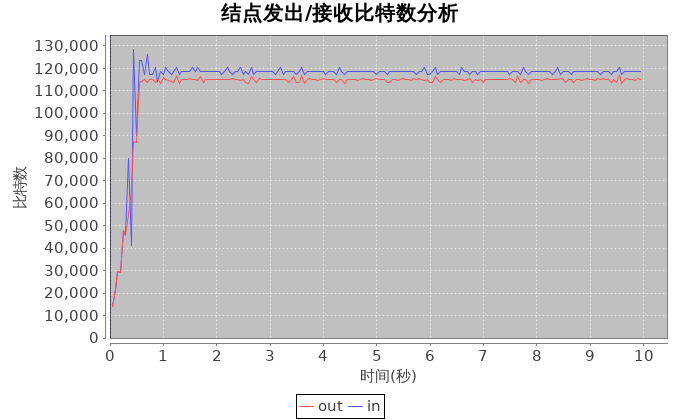{width=600px}      |
| SFQ      | 21018420   | 21328220      | 42.35% | 0.081485 | 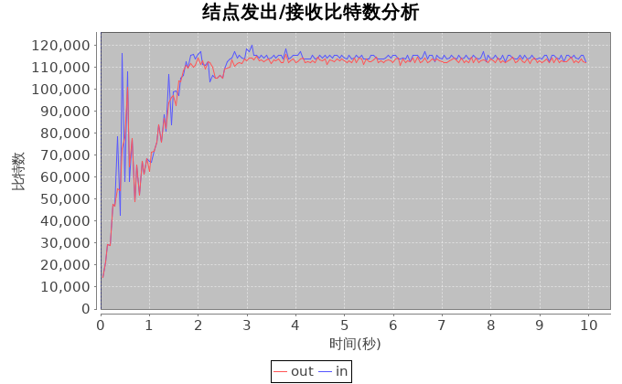{width=600px}     |

### UDP pack size = 1000

| Proxy    | Total Sent | Total Receive | Usage  | Delay    | Send/Receive                             |
|:---------|:-----------|:--------------|:-------|:---------|:-----------------------------------------|
| DropTail | 15261220   | 15856340      | 31.12% | 0.081485 | 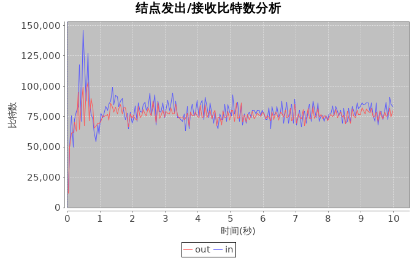{width=600px}|
| DRR      | 15588720   | 16512600      | 32.10% | 0.081485 | 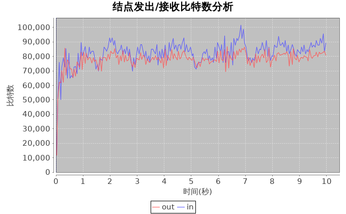{width=600px}     |
| RED      | 14548140   | 15153160      | 29.70% | 0.081485 | 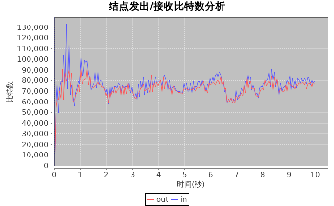{width=600px}     |
| FQ       | 22515180   | 30473780      | 52.98% | 0.081485 | 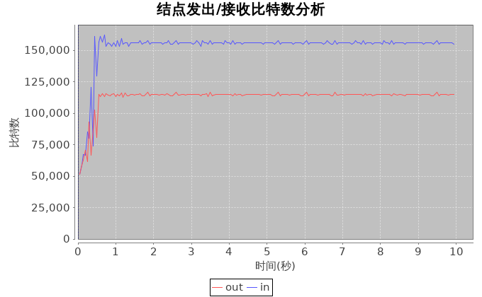{width=600px}      |
| SFQ      | 17076080   | 19510380      | 36.58% | 0.081485 | 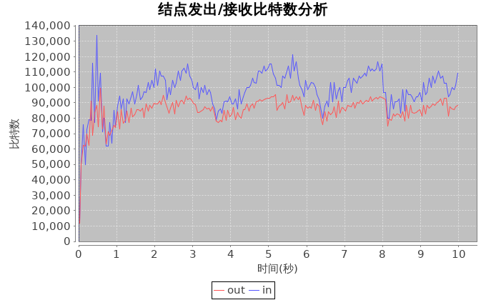{width=600px}     |

### UDP pack size = 2000

| Proxy    | Total Sent | Total Receive | Usage  | Delay    | Send/Receive                               |
|:---------|:-----------|:--------------|:-------|:---------|:-------------------------------------------|
| DropTail | 12984460   | 21128200      | 34.11% | 0.081485 | {width=600px}|
| DRR      | 15518840   | 26256460      | 41.78% | 0.081485 | 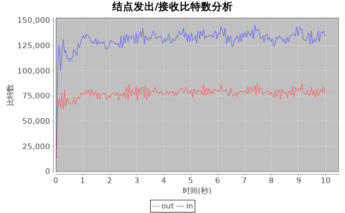{width=600px}     |
| RED      | 12574620   | 20261440      | 32.83% | 0.081485 | {width=600px}     |
| FQ       | 22549720   | 40455320      | 63.01% | 0.081485 | 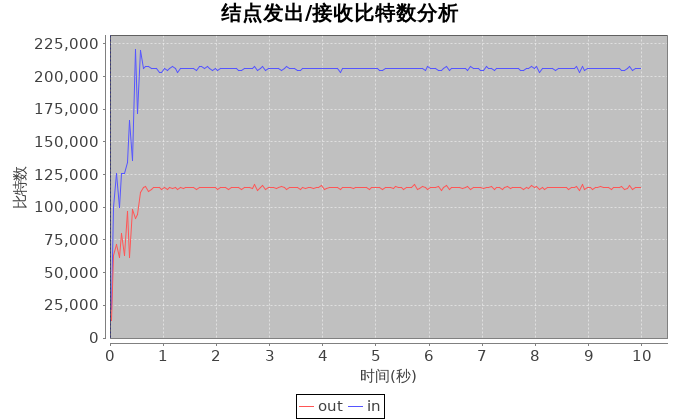{width=600px}      |
| SFQ      | 16381980   | 27969380      | 44.35% | 0.081485 | 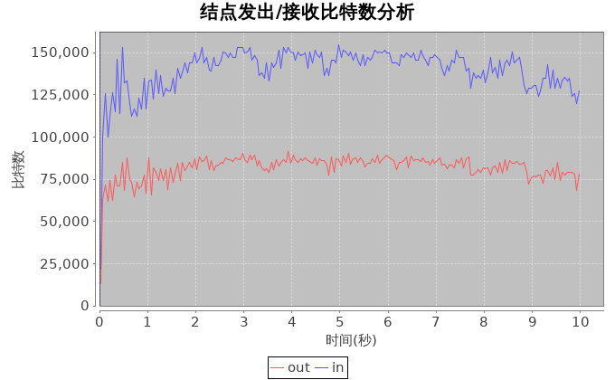{width=600px}     |

## 横向对比
| Proxy    | UDP Pack size = 250                        | UDP Pack size = 1000                    | UDP Pack size = 2000                      |
|:---------|:-------------------------------------------|:----------------------------------------|:------------------------------------------|
| DropTail |{width=600px}|{width=600px}|{width=600px}|
| DRR      |{width=600px}     |{width=600px}     |{width=600px}     |
| RED      |{width=600px}     |{width=600px}     |{width=600px}     |
| FQ       |{width=600px}      |{width=600px}      |{width=600px}      |
| SFQ      |{width=600px}     |{width=600px}     |{width=600px}     |
